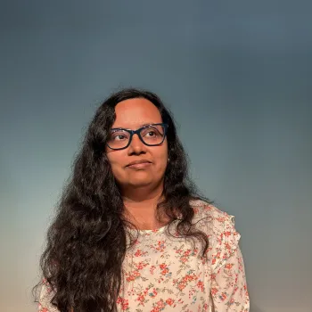

---
hide:
  - toc
  - navigation
---
<!--
CHECKLIST FOR THIS PAGE:
- [x] Replace [YOUR NAME] with your full name (3 places)
- [x] Replace [YOUR JOB TITLE] with your current or target role
- [x] Replace [YOUR TAGLINE] with a short phrase describing your focus
- [x] Rewrite the About Me paragraph with your own words
- [x] Replace assets/images/profile.png with your actual photo (keep the filename or update it below)
- [x] Replace assets/images/about.png with your own image (a field photo, map, or workspace shot)
- [x] Edit the skill cards to match your actual skills (add, remove, or rename cards as needed)
- [x] Update GitHub and LinkedIn links in the Connect section
-->

  
  <h1>Sonia Das</h1>
  
<strong>Geospatial Specialist</strong>

  
<em>Urban Planning &amp; Mobility | Remote Sensing | Python</em>

---

## About Me

My work over the past six years has focused on applying geospatial analysis to urban planning,
mobility, and archaeology across research institutions, consulting projects, and interdisciplinary
collaborations. I work extensively with QGIS, ArcGIS Pro, Google Earth Engine, and Python to build
workflows, dashboards, and spatial decision-support tools.

Most recently, I worked with WSP Consultants India on transport and mobility projects for UK
infrastructure planning, and before that at Mod Foundation in Bengaluru on urban systems, stormwater
drain mapping, and citizen-audit workflows. Earlier research experience at NIAS and NTRO involved
remote sensing and geospatial analysis for landscape archaeology, using satellite imagery, DEM
analysis, and historical spatial datasets.

Alongside technical analysis, I enjoy communicating spatial insights through interactive
visualisation, dashboards, and story maps — turning complex spatial data into tools people can
actually use. I am based in Bengaluru, India.

---

[View My Projects :material-arrow-right:](projects/index.md){ .md-button .md-button--primary }

---

## Skills

-   :material-layers:{ .lg .middle } **GIS & Remote Sensing**

    ---

    - ArcGIS Pro, ArcGIS Online, ArcGIS Experience Builder
    - QGIS, SNAP (SAR data)
    - ERDAS Imagine & LPS photogrammetry — DEMs from Cartosat stereo imagery
    - Google Earth Engine

-   :material-code-braces:{ .lg .middle } **Programming**

    ---

    - Python, R, JavaScript
    - Excel for data analysis

-   :material-map:{ .lg .middle } **Python for Mapping & Cloud-Native Geospatial**

    ---

    - Matplotlib, CartoPy, Contextily
    - Folium, Leafmap, Streamlit
    - XArray, DuckDB, STAC, Dask

-   :material-clipboard-text-outline:{ .lg .middle } **Fieldwork & Citizen Science**

    ---

    - GPS fieldwork
    - Kobo Toolbox and ODK for citizen-audit data collection

-   :material-web:{ .lg .middle } **Web & Portfolio Tools**

    ---

    - GitHub and GitHub Pages
    - Static site generators (MkDocs)
    - Using LLMs for data extraction and Markdown content

---

## Connect

[GitHub](https://github.com/soniadas123){ .md-button }
[LinkedIn](https://www.linkedin.com/in/sonia-das-77b05258/){ .md-button }
