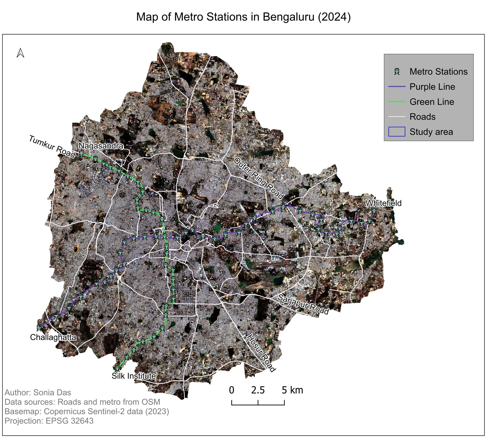

---
hide:
  - toc
  - navigation
---
<!--
CHECKLIST FOR THIS PAGE:
- [ ] Drop each map image into docs/assets/images/ (PNG or JPG, roughly 800px wide is plenty)
- [ ] Copy the template card below once per map, and fill in the image path, title and caption
- [ ] Delete the placeholder card once you have added your first real map
-->

# Map Gallery

Standalone maps and older work that do not have a full project write-up of their own.
Some of it goes back to 2015, but it still shows the skills the newer work is built on.

{ target="_blank" rel="noopener" title="Click to view the full-size map" }

**Metro Stations in Bengaluru**

Purple and Green Line alignments and their stations mapped over a Copernicus Sentinel-2
basemap, with the arterial road network from OpenStreetMap.

`QGIS` `Sentinel-2` `OpenStreetMap`

<!--
TEMPLATE - copy this block for each additional map, inside the 
 above:

Save two copies of each map in docs/assets/images/: a web-sized one (about 1600px wide,
JPEG) for the card, and a "-full" one at original resolution for the click-through.

{ target="_blank" rel="noopener" title="Click to view the full-size map" }

**Map title**

One or two lines describing what the map shows and the data behind it.

`QGIS` `Cartography`

-->
