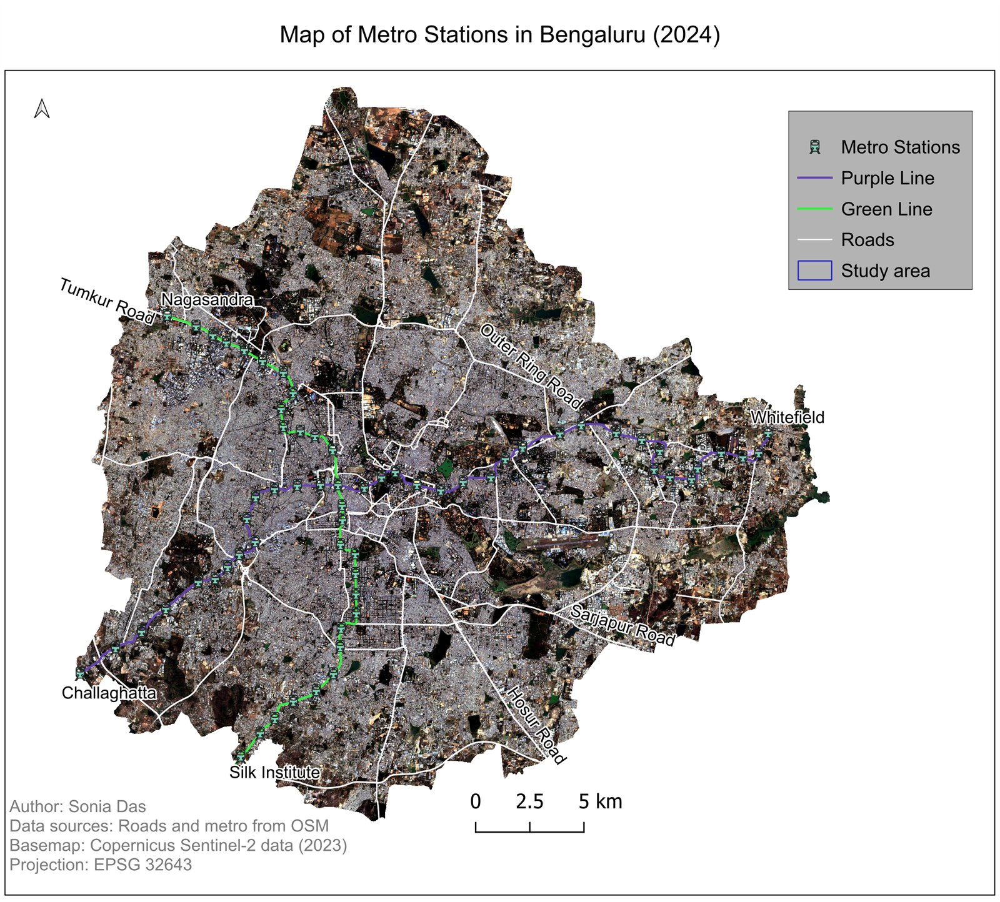
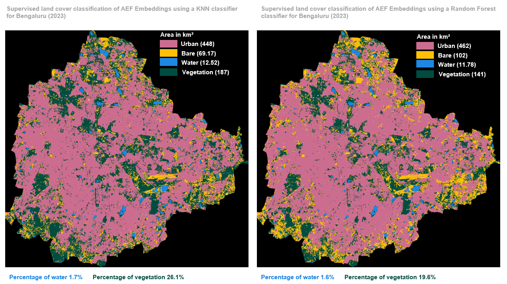
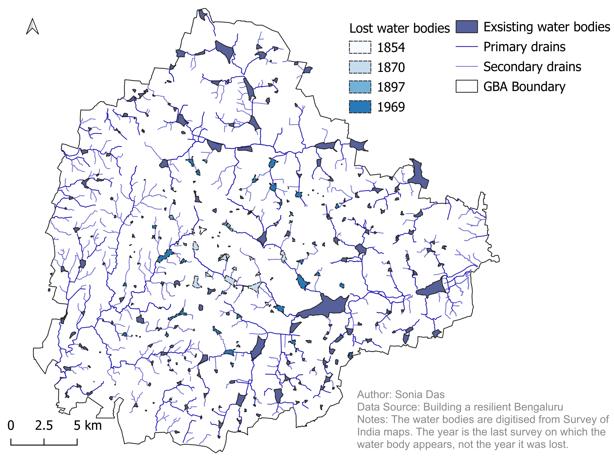

---
hide:
  - toc
---
<!--
CHECKLIST FOR THIS PAGE:
- [ ] Drop each map image into docs/assets/images/ (PNG or JPG, roughly 800px wide is plenty)
- [ ] Copy the template card below once per map, and fill in the image path, title and caption
- [ ] Delete the placeholder card once you have added your first real map
-->

# Map Gallery

Standalone maps and older work that do not have a full project write-up of their own.
Some of it goes back to 2015, but it still shows the skills the newer work is built on.

{ target="_blank" rel="noopener" title="Click to view the full-size map" }

**Metro Stations in Bengaluru**

Purple and Green Line alignments and their stations mapped over a Copernicus Sentinel-2
basemap, with the arterial road network from OpenStreetMap.

`QGIS` `Sentinel-2` `OpenStreetMap`

{ target="_blank" rel="noopener" title="Click to view the full-size map" }

**Land Cover from AlphaEarth Embeddings, Bengaluru 2023**

KNN and Random Forest supervised classifications of AlphaEarth Foundations satellite
embeddings, side by side. The two classifiers agree closely on water (1.7% vs 1.6%) but
diverge on vegetation, at 26.1% against 19.6%.

`Python` `Cloud Native Remote Sensing` `AlphaEarth Embeddings`

{ target="_blank" rel="noopener" title="Click to view the full-size map" }

**Lakes, Drains and Valleys of Bengaluru**

Two companion maps. The first shows existing water bodies and those lost since the
Survey of India maps of 1854, 1870, 1897 and 1969, with the primary and secondary drains.
The [second map](assets/images/bengaluru-watershed-valleys.png){ target="_blank" rel="noopener" }
places the stormwater drain network and lakes in the city's valleys over an SRTM elevation model.

`QGIS` `Hydrology` `SRTM DEM`

<!--
TEMPLATE - copy this block for each additional map, inside the 
 above:

Save two copies of each map in docs/assets/images/: a web-sized one (about 1600px wide,
JPEG) for the card, and a "-full" one at original resolution for the click-through.

{ target="_blank" rel="noopener" title="Click to view the full-size map" }

**Map title**

One or two lines describing what the map shows and the data behind it.

`QGIS` `Cartography`

-->
