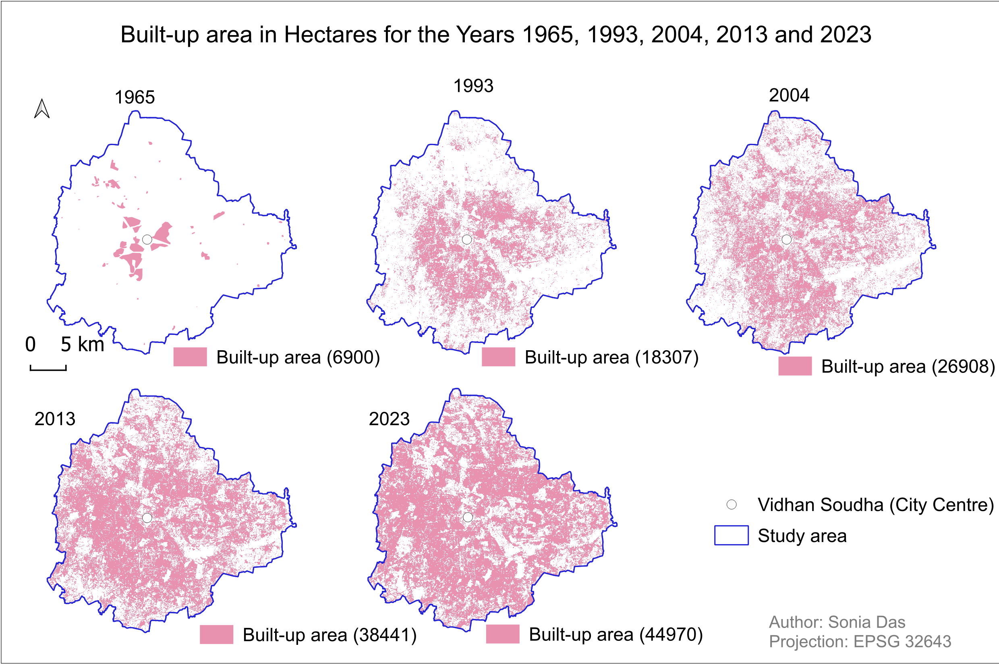

# Built-up Growth in Bengaluru, 1965-2023

## Overview

Measuring how far Bengaluru's built-up land — buildings and roads — has spread over 58 years,
starting from the oldest satellite imagery available for the city. The 1965 extent is digitised
from declassified CORONA imagery in QGIS; the 1993, 2004, 2013 and 2023 extents are classified
from Landsat and Sentinel imagery with a Random Forest classifier in Google Earth Engine. The
built-up area for every year is then measured from the pixel counts in QGIS.

- **Study Area:** Bengaluru, India
- **Period:** 1965-2023
- **Projection:** EPSG:32643 (UTM zone 43N)
- **Role:** Solo project
- **Status:** Completed

---

## Methods & Tools

**Data Sources**

- Declassified CORONA satellite imagery (1965)
- Landsat and Sentinel imagery (1993, 2004, 2013, 2023)

**Processing Steps**

*1965 — georeferencing and digitising in QGIS*

1. Georeferenced the CORONA imagery using control points taken from road intersections,
   buildings and lake boundaries, with nearest-neighbour resampling and a third-order
   polynomial transformation
2. Clipped and merged the georeferenced scenes into a single raster
3. Digitised the built-up extent from that raster, where built-up land and vegetation stand
   out as the darker tones in the panchromatic image

*1993-2023 — supervised classification in Google Earth Engine*

4. Generated an image composite for each target year
5. Collected ground control points for four classes: built-up, water, bare and vegetation
6. Classified each composite with a Random Forest supervised classifier
7. Downloaded the classified rasters and visualised them in QGIS

*Area measurement in QGIS*

8. Ran a per-pixel report on each classified raster and converted the pixel count for the
   built-up class into hectares

**Tools Used**

| Tool | Purpose |
|------|---------|
| QGIS | Georeferencing and digitising the 1965 CORONA imagery, per-pixel area reports, map layout |
| Google Earth Engine | Random Forest supervised classification of the Landsat and Sentinel imagery |

---
## Key Findings

| Year | Built-up area (ha) | Change | Average per year |
|------|--------------------|--------|------------------|
| 1965 | 6,900 | — | — |
| 1993 | 18,307 | +11,407 | +407 ha |
| 2004 | 26,908 | +8,601 | +782 ha |
| 2013 | 38,441 | +11,533 | +1,281 ha |
| 2023 | 44,970 | +6,529 | +653 ha |

- Built-up land grew from 6,900 ha to 44,970 ha over the 58 years, an increase of 38,070 ha
  and roughly six and a half times the 1965 footprint
- The fastest expansion falls in 2004-2013, averaging about 1,280 ha a year, more than three
  times the average rate across 1965-1993
- In 1965 the built-up land sits in separate patches around the city centre; by 2023 it covers
  most of the study area, with only scattered unbuilt pockets left
