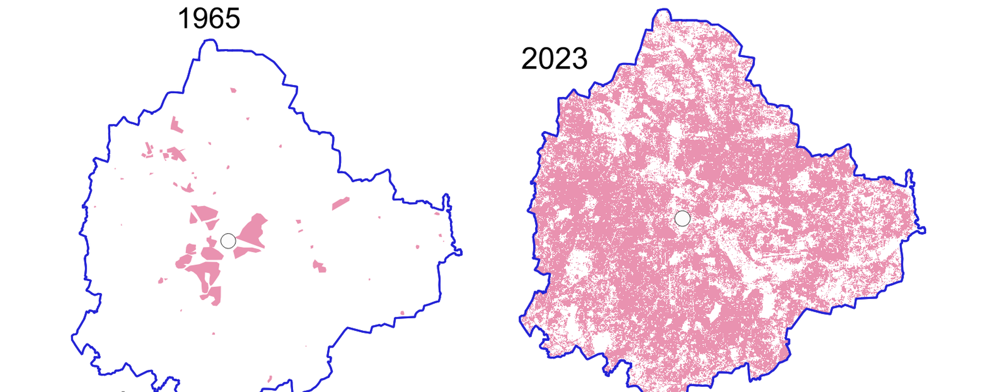

---
hide:
  - toc
  - navigation
---
<!--
CHECKLIST FOR THIS PAGE:
- [ ] Replace the two placeholder cards (marked [YOUR PROJECT ...]) with your real projects
- [ ] For each project: add a thumbnail image to docs/assets/images/ and update the path below
- [ ] For each project: create a project page by copying sample-project.md
- [ ] For each project: add a nav entry in mkdocs.yml (see the comments there)
- [ ] Delete placeholder cards you don't need yet
-->

# Projects

A selection of my geospatial projects. Click any card to see the full write-up.

## Agentic AI for Geospatial

Projects built through agentic coding workflows, applying AI-assisted development to geospatial tools and data.

**[Personal Knowledge Base](https://soniadas123.github.io/personal_knowledge_base/)**

A Claude-Code-maintained notes vault that ingests raw notes, organizes them into a linked
wiki of geospatial and archaeology topics, and auto-publishes to GitHub Pages via MkDocs.

`Claude Code` `MkDocs` `Markdown`

[View Project →](https://soniadas123.github.io/personal_knowledge_base/){ .md-button }

**[Bangalore Metro Population Map](https://github.com/soniadas123/bangalore-metro-population-map)**

Interactive map comparing Namma Metro station coverage against Bengaluru's population
(WorldPop), with a client-side draw-a-buffer tool. Fully static, GitHub Pages deployed.

`JavaScript` `WorldPop` `Leaflet`

[View Project →](https://github.com/soniadas123/bangalore-metro-population-map){ .md-button }

**[The Invisible Atlas](https://github.com/soniadas123/invisible-atlas-quiz)**

A browser-based geospatial quiz game built as a multi-page static site, guiding players
through map-reading levels with persistent game state.

`JavaScript` `HTML/CSS` `Game Design`

[View Project →](https://github.com/soniadas123/invisible-atlas-quiz){ .md-button }

---

## Google Earth Engine

Satellite imagery analysis and interactive web apps built in the Earth Engine Code Editor.

**[GEE Project](sample-project.md)**

A Google Earth Engine web app visualising 1965 CORONA satellite imagery of Bengaluru to
push the baseline for studying urban growth back beyond Landsat.

`QGIS` `Google Earth Engine` `Python`

[View Project →](sample-project.md){ .md-button }
[View Web App](https://ee-soniacivil.projects.earthengine.app/view/bengaluru-in-1965){ .md-button }

**[Built-up Growth 1965-2023](bengaluru-builtup-growth.md)**

Random Forest supervised classification of Landsat and Sentinel imagery in Earth Engine,
tracking Bengaluru's built-up footprint from 6,900 ha in 1965 to 44,970 ha in 2023.

`Google Earth Engine` `Random Forest` `QGIS`

[View Project →](bengaluru-builtup-growth.md){ .md-button }

---

## Urban Water & Resilience

Applied and participatory work on Bengaluru's water systems, built with and for the people who use them.

**[Building a Resilient Bengaluru](resilient-bengaluru.md)**

A city-scale citizen audit of Bengaluru's stormwater drains, from ODK/KoboToolbox collection
to a Python dashboard, alongside the maps behind the programme's public exhibitions.

`KoboToolbox` `Python` `QGIS`

[View Project →](resilient-bengaluru.md){ .md-button }

