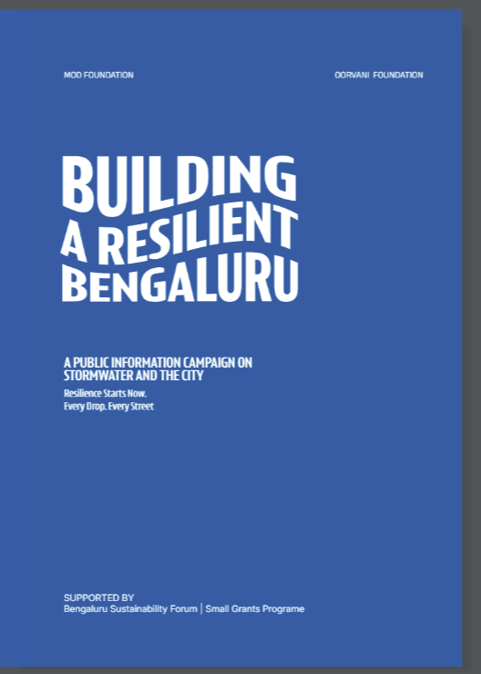

# Building a Resilient Bengaluru: Stormwater Drain Citizen Audit

{ width="330" }

## Overview

Building a Resilient Bengaluru is a public information campaign on stormwater and the city,
run at Mod Foundation. I designed and ran the geospatial workflow behind a city-scale citizen
audit of Bengaluru's primary stormwater drains, and produced the maps and spatial analysis
behind the programme's public exhibitions.

The audit workflow was deliberately built on open-source tools so the team could run and
maintain it after the pilot, and the methodology was designed to be carried out by citizens
and architecture students rather than by specialists.

- **Organisation:** Mod Foundation
- **Duration:** March 2025 – February 2026
- **Role:** GIS Specialist
- **Study Area:** Bengaluru, India
- **Funding:** Bengaluru Sustainability Forum, Small Grants Programme

---

## Stormwater Drain Citizen Audit

- Contributed to the grant writing that secured project funding from the Bengaluru
  Sustainability Forum
- Designed and deployed an end-to-end spatial data pipeline for the city-scale citizen audit,
  from ODK / KoboToolbox ingestion through to a prototype dashboard in Python, covering
  primary drain stretches across Bengaluru
- Tested Mergin Maps, ArcGIS Survey123 and ArcGIS Experience Builder against the requirements,
  then designed, built and executed the audit on an open-source workflow
- Designed and conducted the typology workshop, setting out a methodology for architecture
  students to classify drain stretches by urban adjacency
- Drove public engagement through an online masterclass and three guided citizen audits
- Trained the internal team on the open-source workflow

---

## Maps & Exhibitions

- GIS, DEM and watershed analysis maps for Walk on Bangalore (Water Edition)
- Bus route analysis for the Mobility exhibition (2025)
- Story maps and web maps built with ArcGIS and Streamlit

---

## Tools Used

| Tool | Purpose |
|------|---------|
| KoboToolbox / ODK | Field data collection forms for the citizen audit |
| Python | Spatial data pipeline and the prototype dashboard |
| QGIS | DEM and watershed analysis, exhibition cartography |
| ArcGIS Survey123 / Experience Builder | Evaluated for the audit workflow; story maps and web maps |
| Mergin Maps | Evaluated as a field data collection option |
| Streamlit | Web map and dashboard prototypes |

---

## Links

[Programme Website](https://buildingaresilientbengaluru.com/){ .md-button .md-button--primary }
[City Report](https://buildingaresilientbengaluru.com/resources/#city-report){ .md-button }
