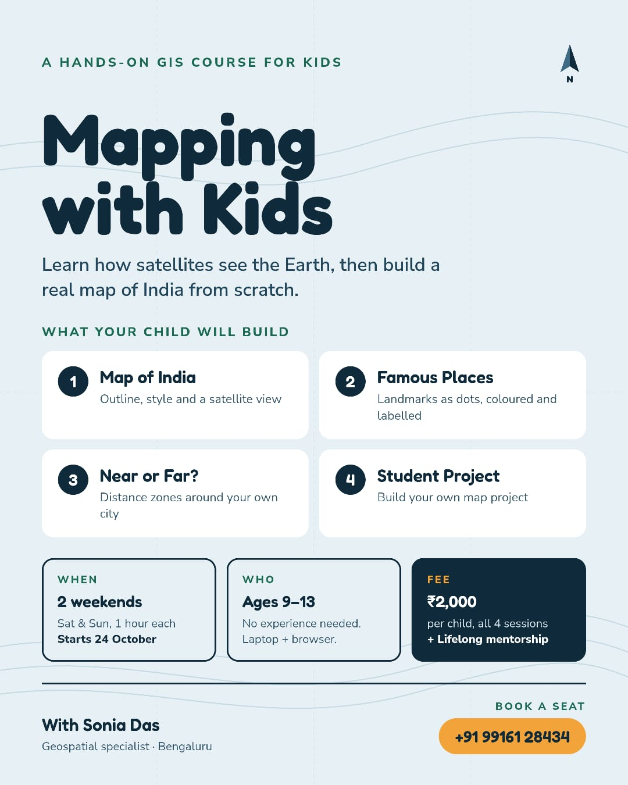

---
hide:
  - toc
---

# Resources

Teaching material and code I have put together for people picking up these tools.

- **Python for Urban Planners** [In development] —
  Beginner friendly Google Colab notebooks that teach Python for spatial analysis using real
  Indian urban datasets. A work in progress: so far it covers mapping Bengaluru's 369 GBA wards
  and turning a citizen field audit into a public dashboard, with more on the way.

## Mapping with Kids { #mapping-with-kids }

**[Mapping with Kids](https://github.com/soniadas123/mapping-with-kids)** — a hands-on GIS
course for children aged 9-13. Kids learn how satellites see the Earth, then build a real
map of India from scratch: an outline map with a satellite view, famous places as labelled
dots, distance zones around their own city, and a final map project of their own.

### Upcoming courses

| Course | Starts | Schedule | Ages | Fee | Booking |
|---|---|---|---|---|---|
| Mapping with Kids - Batch 1 | 24 October 2026 | 2 weekends, Sat & Sun, 1 hour each (4 sessions) | 9-13 | Rs 2,000 per child, includes lifelong mentorship | [sonia.geoai@gmail.com](mailto:sonia.geoai@gmail.com) |

No prior experience needed, just a laptop and a web browser.

[{ width="420" }](assets/images/mapping-with-kids-poster.jpeg){ target="_blank" rel="noopener" title="Click to view the full-size poster" }
